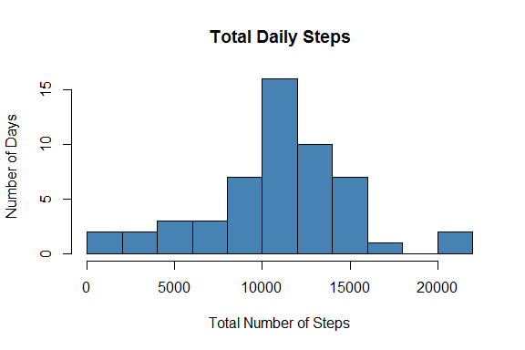
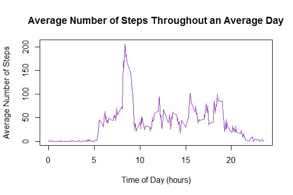
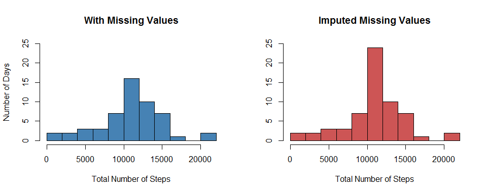
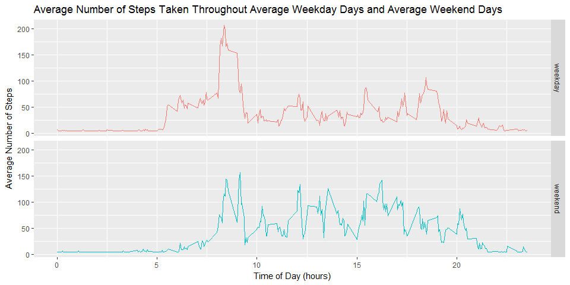

### Summary of Project

A description of this project can be found in the README file of this repository: 
<https://github.com/BigBangData/RepData_PeerAssessment1>

---

### Download Data

First we download the data into our working directory and unzip the compressed file.


```r
fileUrl <- "https://d396qusza40orc.cloudfront.net/repdata%2Fdata%2Factivity.zip"
download.file(fileUrl, destfile = "./activity.zip")
unzip("./activity.zip")
```

---

### Load Data into R 

Then we load the csv file into the R environment, creating an 'activity' data frame.


```r
activity <- read.csv("activity.csv")
```

---

### Pre-process Data 

The function **totalsteps()** processes the activity data by summing up all the steps 
taken in a particular day. Since it makes use of dplyr package, check for installation and load dplyr.


```r
if("dplyr" %in% rownames(installed.packages()) == FALSE) {
	install.packages("dplyr")
}
library(dplyr, warn.conflicts = FALSE)

totalsteps <- function(x) { 
	x %>%
	select(steps, date) %>%
	group_by(date) %>%
	summarise_all(sum) 
}
```

---

### Research Questions 


## What is the mean total number of steps taken per day?


#### Part 1. Total number of steps per day.
 
Passing the 'activity' dataset to **totalsteps()** yields a table of results.
 

```r
totalsteps(activity)
```

```
## # A tibble: 61 x 2
##          date steps
##        <fctr> <int>
##  1 2012-10-01    NA
##  2 2012-10-02   126
##  3 2012-10-03 11352
##  4 2012-10-04 12116
##  5 2012-10-05 13294
##  6 2012-10-06 15420
##  7 2012-10-07 11015
##  8 2012-10-08    NA
##  9 2012-10-09 12811
## 10 2012-10-10  9900
## # ... with 51 more rows
```


#### Part 2. Plot a histogram of the total number of steps.

Passing the steps column of that table to **hist()** generates a histogram of the frequencies (number of days) of certain totals.
 

```r
hist(totalsteps(activity)$steps, breaks = 10, col = "steelblue", 
     main = "Total Daily Steps", xlab = "Total Number of Steps", 
     ylab = "Number of Days")
```

<!-- -->

The distribution of the total daily steps is fairly well centered. About half of the days this individual took a total ranging from 9 to 14 thousand steps, with a couple days of over 20,000 steps and a couple days of less than 1,000 steps.


#### Part 3. Find the Mean and Median of the total number of steps.


```r
summary(totalsteps(activity)$steps)
```

```
##    Min. 1st Qu.  Median    Mean 3rd Qu.    Max.    NA's 
##      41    8841   10765   10766   13294   21194       8
```

The figures confirm and refine our estimates; half of the toals lie between 8,841 and 13,294 steps. The distribution is quite centered around a median of 10765 steps, as the mean is only one step away at 10766. There are 8 days which contain missing values.


## What is the average daily activity pattern?


#### Part 1. Plot a time series of the average number of steps taken in each 5-min interval, averaged across all days.

To calculate mean values, remove missing values from the data set.


```r
activity2 <- activity[!is.na(activity$steps), ] 
```

Calculating averages, grouping by the variable *interval* instead of *date*.


```r
avg5 <- activity2 %>%
	select(steps, interval) %>%
	group_by(interval) %>%
	summarise_all(mean)
head(avg5)
```

```
## # A tibble: 6 x 2
##   interval     steps
##      <int>     <dbl>
## 1        0 1.7169811
## 2        5 0.3396226
## 3       10 0.1320755
## 4       15 0.1509434
## 5       20 0.0754717
## 6       25 2.0943396
```

Plotting a time series to observe the variation in the average number of steps taken in an average day.


```r
plot(avg5$interval/100, avg5$steps, type = "l", col = "purple", 
	main = "Average Number of Steps Throughout an Average Day", 
	xlab = "Time of Day (hours)", ylab = "Average Number of Steps")
```

<!-- -->


#### Part 2. Find the 5-minute interval, averaged across all the days, with the maximum number of steps.
	

```r
topsteps <- avg5 %>% arrange(desc(steps))
head(topsteps)
```

```
## # A tibble: 6 x 2
##   interval    steps
##      <int>    <dbl>
## 1      835 206.1698
## 2      840 195.9245
## 3      850 183.3962
## 4      845 179.5660
## 5      830 177.3019
## 6      820 171.1509
```

We only need to arrange the *steps* variable in descending order to find the 5-minute intervals with the top number of steps taken. The interval of time 835-840 (8:35 a.m. to 8:40 a.m.) has the highest average number: 206 steps.


## What is the impact of imputing missing data on this data set?


#### Part 1. Find total number of missing values in the dataset. 


```r
length(which(is.na(activity$steps) == TRUE))
```

```
## [1] 2304
```

The total number of missing values is 2304.


#### Part 2. Devise a strategy for filling in all of the missing values in the dataset. 
2304 is 288 times 8 (288 being the number of 5-min intervals in 1 day). It stands to reason that there might be 8 full days of missing data, since we noticed earlier that 8 days had NA values. A possible explanation is that the user never turned on the sensor during those days, but still took an average number of steps, so these steps should be accounted for when considering all 61 days and not just 53 days.

After some exploratory data analysis to confirm that those 8 days are indeed the only NA values present in the data set, I created a vector of "NA days" with the dates of those 8 days of missing data.


```r
NAdays <- unique(activity$date[which(is.na(activity$steps) == TRUE)])
as.Date(NAdays)
```

```
## [1] "2012-10-01" "2012-10-08" "2012-11-01" "2012-11-04" "2012-11-09"
## [6] "2012-11-10" "2012-11-14" "2012-11-30"
```

The strategy of using a mean or median for a given day or 5-minute interval would not work, since there is no data for those days. I use the average between the mean and median number of steps for an average day (as previously computed for the 53 days of non-missing values), and divide that by the number of NA values observed in a day (288 intervals of 5 mins) to find the average steps taken in any 5-min interval.


```r
NAsub <- ((10765+10766)/2)/288
NAsub
```

```
## [1] 37.38021
```

The imputing strategy is to substitute 'NAsub' for the NA values in the dataset, changing each missing value into 37.38021.


#### Part 3. Create a new dataset that is equal to the original dataset but with the missing data filled in.

Keeping the original dataset intact so as to show comparison later, I create the 'activity3' data set and fill the NA values in it.
	

```r
activity3 <- activity 
activity3$steps[which(is.na(activity3$steps) == TRUE)] <- NAsub
activity3[285:292, ]
```

```
##        steps       date interval
## 285 37.38021 2012-10-01     2340
## 286 37.38021 2012-10-01     2345
## 287 37.38021 2012-10-01     2350
## 288 37.38021 2012-10-01     2355
## 289  0.00000 2012-10-02        0
## 290  0.00000 2012-10-02        5
## 291  0.00000 2012-10-02       10
## 292  0.00000 2012-10-02       15
```

This particular slice of the data shows the new, filled-in values, through the first day change (crossing that 288th 5-min interval). 


#### Part 4. Plot a histogram, calculate summary statistics, and compare with previous results containing NA values.


```r
par(mfrow = c(1, 2))

hist(totalsteps(activity)$steps, breaks = 10, col = "steelblue", ylim = c(0,25), 
     main = "With Missing Values", xlab = "Total Number of Steps", 
     ylab = "Number of Days")

hist(totalsteps(activity3)$steps, breaks = 10, col = "indianred3", ylim = c(0,25), 
     main = "Imputed Missing Values", xlab = "Total Number of Steps", ylab = "")
```

<!-- -->

Istead of 0 steps for those 8 days of NA values we got the average 10,765.5 steps for each of those days. This increased the bin of 10,000s by 8 counts, from 16 days to 24 days (and 86,124 extra steps), while the other bins remain the same, concentrating the ditribution.


```r
summary(totalsteps(activity3)$steps)
```

```
##    Min. 1st Qu.  Median    Mean 3rd Qu.    Max. 
##      41    9819   10766   10766   12811   21194
```

The summary statistics confirm the concentration and centering as now half of the observations fall within a narrower band of totals (9,819 to 12,811) and the median and mean are the same at 10,766 total steps. 

This average of 10,766 steps per day stays the same as in our original calculation since we discarded the NA days, discounting those 0 averages in our original calculation of an average day. By adding exactly the average of total steps (8 times, in our case) to our new calculations, we ensure that the average stays put. 

So using this strategy, the impact of imputing missing data on the estimates of the total daily number of steps is negligible or null; imputing missing data only affects the overall distribution.


## Are there differences in activity patterns between weekdays and weekends?


#### Part 1. Create a new factor variable with two levels, "weekday" and "weekend," indicating whether a given date is a weekday or not.
	
The new factor variable *wkday* is added to the filled in dataset ('activity3').
	

```r
activity3$wkday <- ifelse(weekdays(as.Date(activity3$date)) == "Saturday" |
                                weekdays(as.Date(activity3$date)) == "Sunday", "weekend", "weekday")
activity3[2015:2020, ]
```

```
##         steps       date interval   wkday
## 2015  0.00000 2012-10-07     2350 weekend
## 2016  0.00000 2012-10-07     2355 weekend
## 2017 37.38021 2012-10-08        0 weekday
## 2018 37.38021 2012-10-08        5 weekday
## 2019 37.38021 2012-10-08       10 weekday
## 2020 37.38021 2012-10-08       15 weekday
```

A few quick checks, such as the Sunday-to-Monday change of levels above, confirm that this new factor was properly created.


#### Part 2. Make a panel plot containing two time series of the 5-minute interval and the average number of steps taken, averaged across all weekday or weekend days. 
	
Using ggplot2 package, first check for installation and load.


```r
if("ggplot2" %in% rownames(installed.packages()) == FALSE) {
	install.packages("ggplot2")
}
library(ggplot2)
```

The averages of steps need to be calculated for each interval of time and type of day (weekday or weekend). Using dplyr, I group by *interval* and *wkday* with the new data set 'activity3'.


```r
avg5new <- activity3 %>%
	select(interval, wkday, steps) %>%
	group_by(interval, wkday) %>%
	summarise_all(mean)

head(avg5new)
```

```
## # A tibble: 6 x 3
## # Groups:   interval [3]
##   interval   wkday    steps
##      <int>   <chr>    <dbl>
## 1        0 weekday 7.006250
## 2        0 weekend 4.672526
## 3        5 weekday 5.384028
## 4        5 weekend 4.672526
## 5       10 weekday 5.139583
## 6       10 weekend 4.672526
```

Then I use ggplot and the new data set 'avg5new' to plot a panel of time series.


```r
ggplot(avg5new, aes(interval/100, steps)) +
		geom_line(aes(color = wkday), show.legend = FALSE) + 
		facet_grid(wkday ~ .) + 
		labs(title = "Average Number of Steps Taken Throughout Average Weekday Days and Average Weekend Days", 
		     x = "Time of Day (hours)", y = "Average Number of Steps")
```

<!-- -->

The plots show how, on average, this person starts moving around earlier during weekdays, and takes a greater number of steps during the peak activity hour (8 a.m.).

Despite the slower start on weekends, the individual sustains a greater amount of activity throughout the weekend day. 

Further exploration is needed to asses whether this average of sustained activity during weekend afternoons is due to a consistent schedule (of errands, say) or is a combination of factors such as lazy afternoons coupled with very active afternoons of tennis matches or mountaneering. 


---


